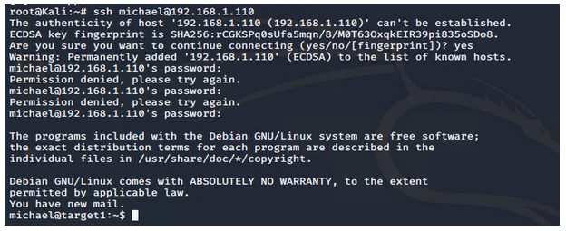
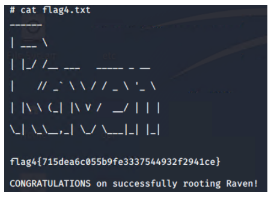

# Pentest-Reports

Security Penetration Test of

X-CORP
# Version

V1.0 October 22nd, 2021

Prepared by:

Tyson Smith

Presented to:

X-CORP

IP: 192.168.1.110

# Confidentiality

In no event shall the testing company be liable to anyone for special, incidental, collateral or consequential damages arising out of the use of this information.

This document contains information, which is confidential and proprietary to the conducting party and client. Extreme care should be exercised before distributing copies of this document, or the extracted contents of this document. We are authorizing the contact at X-CORP to view and disseminate this document as he/she sees fit in accordance with X-CORP data handling policy and procedures. This document should be marked “CONFIDENTIAL” and therefore we suggest that this document be disseminated on a “need to know” basis.

# Disclaimers

The information presented in this document is provided as is and without warranty. Vulnerability assessments are a “point in time” analysis and as such it is possible that something in the environment could have changed since the tests reflected in this report were run. Also, it is possible that new vulnerabilities may have been discovered since the tests were run. For this reason, this report should be considered a guide, not a 100% representation of the risk threatening your systems, networks, or applications.

1 Contents

[Version	1](#_heading=h.gjdgxs)

[Confidentiality	2](#_heading=h.30j0zll)

[Disclaimers	2](#_heading=h.1fob9te)

[2	Purpose	4](#_heading=h.3znysh7)

[3	Scope	4](#_heading=h.2et92p0)

[4	Executive Summary	4](#_heading=h.tyjcwt)

[5	Summary of Findings	5](#_heading=h.3dy6vkm)

[5.1	Severity of Vulnerability	5](#_heading=h.1t3h5sf)

[5.2	Network Scan	6](#_heading=h.4d34og8)

[5.3	WordPress Scan	7](#_heading=h.2s8eyo1)

[5.4	Poor Password Policy	8](#_heading=h.17dp8vu)

[5.5	Poorly Configured Secret Files	8](#_heading=h.3rdcrjn)

[5.6	MySQL	9](#_heading=h.26in1rg)

[5.7	Brute-Force	9](#_heading=h.lnxbz9)

[5.8	SUID Check	10](#_heading=h.35nkun2)

[5.8.1 Python WebServer	10](#_heading=h.1ksv4uv)

[5.8.2	Folder Permissions	11](#_heading=h.44sinio)

[5.9 Privilege Escalation	11](#_heading=h.2jxsxqh)

[6	Conclusion and Recommendations	13](#_heading=h.3j2qqm3)

#
# 2	Purpose

X-CORP has requested a detailed security examination of their network. This testing took place in October 2021 and concluded on the 26th of October 2021. This report is being presented to show the full results of our testing efforts and to make recommendations where appropriate.

# 3	Scope

The scope of this review was to conduct a penetration test on X-CORP and find any vulnerabilities that can leave them open to compromise.

# 4	Executive Summary

Throughout this penetration test there was multiple vulnerabilities uncovered. These vulnerabilities led to a complete compromise of the target with root user access and the ability to steal, encrypt and ransom or delete sensitive information for the company.

We were able to complete a scan of the network and uncover open ports that we could use to manipulate the WordPress server.

We were then able to get login information and SSH into another open port (22) and guess the password due to poor password policies.

This led us to an SQL database dump that gave us more password hashes that we were able to crack, which gave us login information for a user with access to a sudo command. We were able to leverage this sudo command to gain root access over the machine and completely compromise the system.

We have supplied mitigation strategies on the final page of the report.

# 5	Summary of Findings

The target Machines IP Address was 192.168.1.110 and this is the IP address we will be conducting the entire attack on.

Hostname for the target was target1.

Multiple vulnerabilities were exploited to eventually gain root user, such as poor password policies, poorly configured secret files, brute-force attack, and privilege escalation within the system.

## 5.1	Severity of Vulnerability

Poor password policy – Critical

Poorly configured secret files – Critical

Brute-force attack – High

Privilege escalation – Critical

## 5.2	Network Scan

The first stage of the test was performing a network scan on the target to see if we can find any potential openings for our attack.

In the below screenshot we can see that port 22, 80, 111, 139, 445, 48304 are open. Because we can see that port 80 is open, we can try viewing the website in our browser with the IP <http://192.168.1.110>.

One we travelled to the webpage we can inspect the page source to see what’s there.

This gave us information that it was running on WordPress server, which gives us some more insight into what type of vulnerability they may be susceptible to.

## 5.3	WordPress Scan

Now that we know it’s running a WordPress server, we can use WPScan to enumerate some information.

This scan provided us with the initial information required to get inside the target. The user’s Michael and Steven were found through this WPScan.

## 5.4	Poor Password Policy

Having a poor password policy leaves every company potentially open for malicious activity. As such after we conducted the WPScan we saw Michael’s username, so we tried SSHing into port 22 that we saw was open from earlier in the initial nmap scan. With a few attempts at his password, we were able to break into the target. This is a perfect example of poor password policy within the company as his password was simply ‘michael’.

Below is a photo of the few attempts I made before getting inside.

Now that we are in to the first account we can look around for more information. We were able to find some flags here.

## 5.5	Poorly Configured Secret Files

Because we know that they are running a WordPress server, we checked for the wp-config.php file that can contain confidential information.

When we look at the file, we can see in the screenshot below the login information for the MySQL database. This file had no restricted permissions set on it which meant that any user could access this and see these confidential credentials.

## 5.6	MySQL

Because we saw credentials for MySQL we can do a mysqldump to see information on the SQL database. In the photos below we can see the command used to perform the dump as well as the password hash for the users.

Now that we have the password hash we can try brute-forcing the password with a tool called John.

While we were doing the SQL dump, we also found another flag.

## 5.7	Brute-Force

Once we found the hash from the MySQLdump we were able to use John to crack the password hash for Steven and give us his login information.

## 5.8	SUID Check

After SSHing into Steven’s account using the password we got from the cracked hash, we can run a simple command ‘sudo -l’ to see the list of available sudo commands we can use. Fortunately, and easily enough we can see that we can use Python.

However, this isn’t always the case, and we could take it a step further to clarify all possible Privilege Escalation strategies.

### 5.8.1	Python WebServer

First, we set up a python web server with our Linux Enumeration script on it as shown in the screenshot below.

After going to our machines IP:4444 (the port we set up the server on) we can see that the script is available.

Now that we have this set up, it’s time to find a folder with writeable permissions on it that we can download the script to.

### 5.8.2	Folder Permissions

Checking out the directories in the root directory shows us that /tmp has writeable permissions for all users.

This is poor configuration and allows us to take advantage of scripts that we can download freely to this target machine.

## 5.9 Privilege Escalation

Now we can go back to our other terminal where we are logged in as Steven and in the /tmp directory we can use the get command to pull the LinEnum.sh script from the web server.

Now we have a Linux Escalation script on the target machine.

For the confirmation we wanted here is the results of the LinEnum scan.

Now running a simple python command: sudo python -c ‘import os; os.system(“/bin/sh”)’ we are now a root user.

# 6	Conclusion and Recommendations

The target machine was vulnerable and poorly configured with folder permissions, as well as user passwords. This could leave openings for malicious damage that could be costly and cause irreparable damage within the company either financially or with its reputation.

The recommendations to mitigate against these attacks in the future are:

- The implementation of a strong password policy within the company. This will ensure that passwords meet certain criteria before being accepted.
- Password history checking that will not allow reused passwords. 
- Password change policies can also be implemented that will prompt users to change their password after a period of time.
- Salting of passwords is a good way of adding a layer of security to passwords as well.
- Making the /tmp folder only writeable for root user and checking other directories permissions as well.
- Closing of ports that are not needed such as SMB on ports 139,445.
- Disabling of any sudo commands on non-root users, in this case sudo python.

